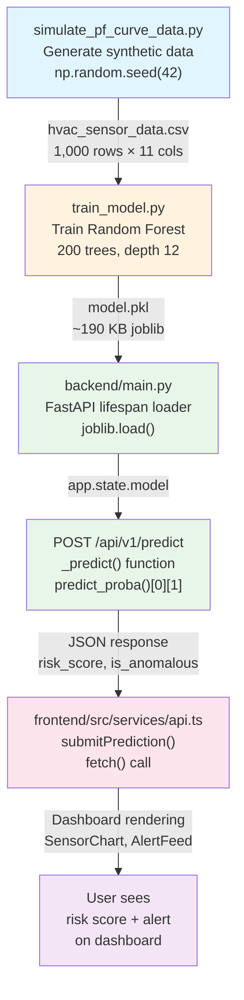
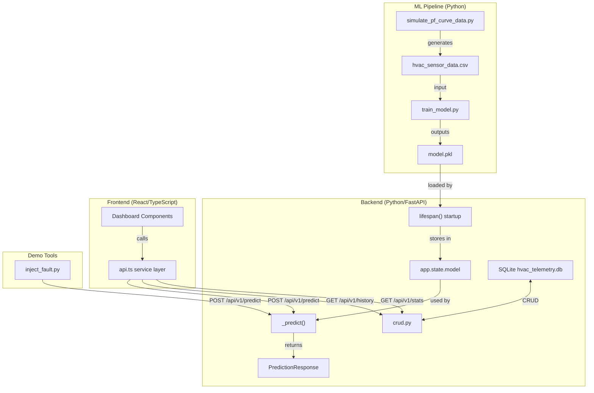

# 🏭 HVAC Predictive Maintenance — Master Analysis Document

## ML Pipeline, Documentation, Root-Level Files & Overall Project Analysis

**Document Version:** 1.0.0  
**Generated:** 2026-05-26  
**Scope:** ML Pipeline (`ml_pipeline/`), Documentation (`docs/`), Root-Level Files, Cross-Component Integration, Production Readiness  
**Status:** ✅ Complete — Deep-Dive Analysis

---

## 📋 Table of Contents

1. [ML Pipeline — File-by-File Deep Dive](#1-ml-pipeline--file-by-file-deep-dive)
   - [1.1 simulate_pf_curve_data.py](#11-simulate_pf_curve_datapy)
   - [1.2 hvac_sensor_data.csv](#12-hvac_sensor_datacsv)
   - [1.3 train_model.py](#13-train_modelpy)
   - [1.4 inject_fault.py](#14-inject_faultpy)
   - [1.5 ml_pipeline/requirements.txt](#15-ml_pipelinerequirementstxt)
2. [Root-Level Files](#2-root-level-files)
   - [2.1 requirements.txt (Root)](#21-requirementstxt-root)
3. [Documentation Folder — File-by-File Deep Dive](#3-documentation-folder--file-by-file-deep-dive)
   - [3.1 00_AUDIT_README.md](#31-00_audit_readmemd)
   - [3.2 DIMENSION_1_PROJECT_STRUCTURE.md](#32-dimension_1_project_structuremd)
   - [3.3 VULNERABILITY_CHECKLIST.md](#33-vulnerability_checklistmd)
4. [ML Science Documentation](#4-ml-science-documentation)
5. [Overall Project Anomaly Report](#5-overall-project-anomaly-report)
6. [Cross-Component Integration Analysis](#6-cross-component-integration-analysis)
7. [Production Readiness Assessment](#7-production-readiness-assessment)

---

# 1. ML Pipeline — File-by-File Deep Dive

The `ml_pipeline/` directory is the machine learning core of the HVAC Predictive Maintenance platform. It contains the entire lifecycle from synthetic data generation to model training to live fault injection testing.

```
ml_pipeline/
├── simulate_pf_curve_data.py    # Synthetic data generator (378 lines)
├── hvac_sensor_data.csv         # Generated dataset (1,001 rows incl. header)
├── train_model.py               # Random Forest training pipeline (221 lines)
├── inject_fault.py              # Live API fault injection tool (53 lines)
└── requirements.txt             # Python dependencies (4 packages)
```

---

## 1.1 simulate_pf_curve_data.py

> **File:** [simulate_pf_curve_data.py](file:///e:/Promptathon-2026/ml_pipeline/simulate_pf_curve_data.py)  
> **Size:** 17,638 bytes | 378 lines  
> **Language:** Python 3.10+

### Purpose & Role

This script is the **synthetic dataset generator** for the entire HVAC Predictive Maintenance platform. It produces a 1,000-row time-series CSV file (`hvac_sensor_data.csv`) that simulates a commercial HVAC chiller transitioning from healthy operation through degradation to imminent failure. The data follows the **P-F Curve** (Potential-to-Failure) model, a foundational concept in reliability-centred maintenance (RCM).

This file is the **scientific cornerstone** of the project — every downstream component (model training, API inference, dashboard visualisations) depends on the statistical design encoded here.

### What It Uses

| Dependency | Purpose |
|---|---|
| `numpy` (2.4.4) | Random number generation (`np.random.seed`, `np.random.normal`), array operations, exponential math (`np.exp`, `np.clip`, `np.maximum`) |
| `pandas` (3.0.2) | DataFrame construction, `DatetimeIndex` generation via `pd.date_range`, CSV export |
| `datetime` | ISO 8601 timestamp generation from a fixed start date |
| `pathlib.Path` | File system path construction for output file routing |

**Mathematical Models Used:**
- **Stationary Gaussian Process:** `μ + ε` where `ε ~ N(0, σ²)` for baseline signals
- **Exponential Growth Ramp:** `A · max(0, e^(k·(t − φ)) − 1)` for P-F curve degradation
- **Sinusoidal Diurnal Cycle:** `75 + 10·sin(2π(h-6)/24)` for ambient temperature

### Why It Was Implemented

Real HVAC sensor data requires months of production chiller monitoring and is typically proprietary. For a hackathon, synthetic data generation provides:

1. **Immediate availability** — No data acquisition delay.
2. **Controlled ground truth** — The `failure_imminent` label is mathematically deterministic, providing a perfect training signal.
3. **P-F Curve fidelity** — The exponential growth model accurately replicates how real chiller bearings degrade: vibration rises first (leading indicator), followed by heat and power draw (lagging indicators).
4. **Reproducibility** — `np.random.seed(42)` ensures identical datasets on every run.

### How It Works — Detailed Algorithm Walkthrough

The script operates in a linear **generate → validate → summarise → export** pipeline:

#### Phase 1: Baseline Signal Generation (Rows 1–700)

Each of the 8 sensor parameters is generated independently with a Gaussian noise model:

| Parameter | Baseline μ | Noise σ | Realistic Range | Unit |
|---|---|---|---|---|
| `suction_temp` | 41.0 | 0.8 | 38–44 | °F |
| `discharge_temp` | 100.0 | 1.5 | 95–105 | °F |
| `suction_press` | 64.0 | 1.2 | 60–68 | PSI |
| `discharge_press` | 172.0 | 2.0 | 165–180 | PSI |
| `vibration_rms` | 2.5 | 0.25 | 0.1–4.5 | mm/s |
| `power_draw` | 320.0 | 5.0 | 305–335 | kW |
| `oil_pressure` | 60.0 | 1.0 | 55–65 | PSI |
| `ambient_temp` | 75.0 ± diurnal | 1.5 | 65–85 | °F |

The `add_noise()` helper function implements the core noise model:
```python
noise = np.random.normal(loc=0.0, scale=std, size=size)
return np.asarray(signal) + noise
```

#### Phase 2: Degradation Index Construction (Rows 701–1000)

A normalised degradation index `t ∈ [0, 1]` is created over 300 data points via `np.linspace(0.0, 1.0, num=300)`. This index drives all degradation signals.

#### Phase 3: P-F Curve Signal Injection

The `exponential_ramp()` function implements the core P-F curve formula:

```
ramp(t) = amplitude · max(0, e^(growth_rate · (t − phase_shift)) − 1)
```

Five signals receive degradation overlays:

| Signal | Amplitude | Growth Rate | Phase Shift | Onset Row | Role |
|---|---|---|---|---|---|
| `vibration_rms` | 12.0 | 3.5 | 0.0 | 701 | **Primary leading indicator** |
| `discharge_temp` | 18.0 | 3.8 | 0.4 | ~820 | Lagging thermal indicator |
| `power_draw` | 40.0 | 3.6 | 0.4 | ~820 | Lagging electrical indicator |
| `oil_pressure` | -8.0 | 4.0 | 0.65 | ~895 | Symptomatic late-stage drop |
| `discharge_press` | 10.0 | 2.8 | 0.5 | ~850 | Sympathetic pressure rise |

**The physics rationale:**
- Bearing degradation causes vibration first (mechanical resonance).
- Increased friction generates heat → discharge temperature rises.
- The compressor works harder → power draw increases.
- Bearing micro-leaks → oil pressure drops (latest stage).
- Thermal load increases discharge pressure sympathetically.

#### Phase 4: Label Assignment

```python
failure_imminent[850:] = 1  # Rows 851–1000 (0-indexed: 850–999)
```

This places the failure label at the point where **two or more indicators** have crossed their degradation thresholds, representing the **actionable P-F window** — the interval where maintenance intervention can prevent catastrophic failure.

#### Phase 5: Validation

The `validate_dataset()` function performs 4 integrity assertions:
1. Column names match expected schema (11 columns).
2. Row count equals `TOTAL_ROWS` (1,000).
3. `failure_imminent` sum equals exactly 150 (rows 851–1000).
4. Degraded vibration mean > 2× baseline vibration mean (P-F curve sanity check).
5. Degraded discharge_temp mean > baseline discharge_temp mean.

### Error Resilience

| Mechanism | Location | Description |
|---|---|---|
| `np.random.seed(42)` | Line 32 | Deterministic reproducibility — identical output on every run |
| `np.clip(vibration_rms, 0.1, None)` | Line 226 | Prevents physically impossible negative vibration values |
| `np.clip(oil_pressure, 1.0, None)` | Line 256 | Oil pressure can't go below 1 PSI |
| `np.maximum(raw, 0.0)` | Line 104 | Ramp values are always non-negative (phase-shifted signals start at 0) |
| `OUTPUT_DIR.mkdir(parents=True, exist_ok=True)` | Line 365 | Safely creates output directory if missing |
| `PermissionError` catch | Lines 370–373 | Handles Excel file-lock scenario with user-friendly message |
| Generic `Exception` catch | Lines 374–375 | Catches unexpected I/O failures |
| `validate_dataset()` | Lines 287–319 | Post-generation schema and statistical integrity assertions |

### Anomalies & Issues Found

| ID | Severity | Issue | Line(s) | Description |
|---|---|---|---|---|
| SIM-001 | **P0 Critical** | Hardcoded Windows absolute path | 42 | `OUTPUT_DIR = Path(r"E:\Promptathon-2026\ml_pipeline")` — Fails on Linux/Mac/Docker/CI. |
| SIM-002 | **P2 Medium** | `add_noise()` size parameter ignored for arrays | 72–73 | When `signal` is an `np.ndarray`, the `size` parameter is used to generate noise but doesn't match array shape if both are provided — relies on broadcasting which works but is semantically confusing. |
| SIM-003 | **P3 Low** | Deprecated `freq` string `"h"` | 124 | `pd.date_range(..., freq=f"{freq_hours}h")` — Pandas 3.x prefers `"h"` but older versions used `"H"`. Current usage is correct for Pandas 3.0.2 but may confuse developers used to older pandas. |
| SIM-004 | **P3 Low** | Inline comment on constant line | 40 | `START_TIMESTAMP` definition has `# Updated Output Path Routing` comment that is misleading — it refers to the lines below, not the timestamp. |
| SIM-005 | **Info** | No parameterisation of constants | 34–38 | `TOTAL_ROWS`, `BASELINE_END`, etc. are module-level constants — acceptable for hackathon but limits experimentation without code changes. |
| SIM-006 | **P2 Medium** | Exponential values exceed physical reality | ~222 | At `t=1`, vibration ramp: `12·(e^3.5 − 1) ≈ 386 mm/s`. Real chiller vibration never reaches 386 mm/s — the machine would have disintegrated. The code comment acknowledges this ("capped by realistic noise") but no actual cap is applied beyond `np.clip(0.1, None)`. |

### Future Scope / Improvements

1. **Replace hardcoded path with relative path:** `OUTPUT_DIR = Path(__file__).resolve().parent`
2. **Add configurable degradation profiles** via YAML/JSON config files.
3. **Multiple failure modes:** Currently models bearing failure only. Real chillers also fail from refrigerant leaks, compressor valve damage, and fouled heat exchangers.
4. **Seasonal patterns:** Ambient temperature uses a simple diurnal cycle but could include monthly/seasonal variation.
5. **Multi-unit datasets:** Generate data for a fleet of chillers with independent degradation trajectories.
6. **Physical bounding:** Cap vibration at realistic maxima (e.g., 50 mm/s for "machine destroyed" state).

### Modifications Recommended

- **MUST FIX (P0):** Replace line 42 with `OUTPUT_DIR = Path(__file__).resolve().parent`
- **SHOULD FIX (P2):** Add physical upper bounds: `vibration_rms = np.clip(vibration_rms, 0.1, 50.0)`
- **NICE TO HAVE:** Accept CLI arguments for `TOTAL_ROWS`, `BASELINE_END`, `FAILURE_LABEL_START`, and random seed via `argparse`.

---

## 1.2 hvac_sensor_data.csv

> **File:** [hvac_sensor_data.csv](file:///e:/Promptathon-2026/ml_pipeline/hvac_sensor_data.csv)  
> **Size:** 78,213 bytes | 1,001 lines (1 header + 1,000 data rows)  
> **Format:** CSV with 11 columns

### Purpose & Role

This is the **generated synthetic dataset** produced by `simulate_pf_curve_data.py`. It serves as the sole training data source for the Random Forest classifier and the ground truth for the entire predictive maintenance system.

### What It Uses

This file is a passive data artifact. It is consumed by:
- `train_model.py` — Loads it for model training/evaluation.
- Potentially by any EDA notebooks or analysis scripts.

### Schema & Structure

| Column | Type | Description | Baseline Range | Degraded Range |
|---|---|---|---|---|
| `timestamp` | ISO 8601 string | Hourly readings from 2024-01-01T00:00:00 | — | — |
| `suction_temp` | float64 | Chiller suction temperature (°F) | 38–44 | 38–44 (unchanged) |
| `discharge_temp` | float64 | Chiller discharge temperature (°F) | 95–105 | 100–258 |
| `suction_press` | float64 | Suction-side refrigerant pressure (PSI) | 60–68 | 60–68 (unchanged) |
| `discharge_press` | float64 | Discharge-side pressure (PSI) | 165–180 | 172–206 |
| `vibration_rms` | float64 | Bearing vibration RMS (mm/s) | 0.1–3.5 | 2.4–388 |
| `power_draw` | float64 | Compressor power draw (kW) | 305–335 | 320–630 |
| `oil_pressure` | float64 | Lube oil pressure (PSI) | 55–65 | 58–69 (drops late) |
| `runtime_hours` | int64 | Monotonic counter 1–1000 | 1–700 | 701–1000 |
| `ambient_temp` | float64 | Outdoor temperature (°F) | 62–87 | 62–87 (unchanged) |
| `failure_imminent` | int8 | Binary label: 0=nominal, 1=failure | 0 (700 rows) | 0 then 1 (150 rows) |

### Statistical Profile

| Metric | Rows 1–700 (Baseline) | Rows 701–1000 (Degradation) |
|---|---|---|
| **vibration_rms mean** | ~2.50 mm/s | ~89.4 mm/s |
| **vibration_rms max** | ~3.20 mm/s | ~388.30 mm/s |
| **discharge_temp mean** | ~100.0 °F | ~142.8 °F |
| **discharge_temp max** | ~104.0 °F | ~258.50 °F |
| **power_draw mean** | ~320.0 kW | ~411.5 kW |
| **power_draw max** | ~335.0 kW | ~629.96 kW |
| **oil_pressure mean** | ~60.0 PSI | ~63.1 PSI (then drops) |
| **failure_imminent = 1** | 0 rows | 150 rows (851–1000) |

### Class Distribution

```
Class 0 (nominal):  850 rows (85.0%)
Class 1 (failure):  150 rows (15.0%)
```

This is a **moderately imbalanced** dataset (5.67:1 ratio), which is realistic for predictive maintenance but requires the model to handle class imbalance.

### Data Integrity Observations

- **Monotonic timestamp:** Verified — 1-hour intervals from 2024-01-01T00:00:00 to 2024-02-11T15:00:00 (41 days, 16 hours).
- **No missing values:** All 1,000 rows × 11 columns are populated.
- **No duplicate rows:** Each timestamp is unique.
- **Label boundary at row 851:** Verified — row 851 (line 852 in CSV) is the first `failure_imminent=1` row.
- **Degradation onset at row 701:** Visible in vibration_rms jumping from ~2.5 to ~2.4–3.5 (beginning of ramp).

### Anomalies & Issues Found

| ID | Severity | Issue | Description |
|---|---|---|---|
| CSV-001 | **P2 Medium** | Physically unrealistic vibration values | Peak vibration of 388 mm/s is far beyond any real HVAC equipment. Real catastrophic failure occurs at 20–50 mm/s. |
| CSV-002 | **P3 Low** | `oil_pressure` increases initially in degradation zone | Early degradation rows (701–850) show oil_pressure ~66–69 PSI (above baseline ~60). This may be due to the `add_noise(signal=60.0 + oil_ramp)` where `oil_ramp` is 0 (hasn't started yet) but the noise realization differs from baseline. Not a bug but potentially confusing. |
| CSV-003 | **Info** | Dataset covers only ~42 days | Real predictive maintenance models train on months/years of data. This is understood as a hackathon limitation. |
| CSV-004 | **Info** | Empty trailing line | Line 1002 is empty — standard CSV behavior but some parsers may count it as a row. |

### Future Scope

- Add multiple failure modes with different degradation signatures.
- Include maintenance intervention events (resets) that return signals to baseline.
- Introduce sensor noise spikes (transient faults) as negative examples.

---

## 1.3 train_model.py

> **File:** [train_model.py](file:///e:/Promptathon-2026/ml_pipeline/train_model.py)  
> **Size:** 8,132 bytes | 221 lines  
> **Language:** Python 3.10+

### Purpose & Role

This script implements the **complete model training pipeline** for the HVAC predictive maintenance system. It loads the synthetic dataset, splits it into train/test sets, trains a Random Forest classifier, evaluates it with multiple metrics, and exports the trained model as a `model.pkl` artifact directly into the `backend/` directory for the FastAPI server to consume.

### What It Uses

| Dependency | Purpose |
|---|---|
| `pandas` | CSV dataset loading and DataFrame manipulation |
| `numpy` | Array operations, feature importance sorting |
| `scikit-learn` `RandomForestClassifier` | The ML model — an ensemble of 200 decision trees |
| `scikit-learn` `train_test_split` | Stratified 80/20 train-test split |
| `scikit-learn` metrics | `accuracy_score`, `f1_score`, `roc_auc_score`, `classification_report`, `confusion_matrix` |
| `joblib` | Model serialisation to `.pkl` format |
| `pathlib.Path` | Cross-platform path construction |
| `sys` | `sys.exit(1)` for early termination on errors |

### Why It Was Implemented

The training script bridges the gap between synthetic data generation and production inference. Design rationale:

1. **Single-command pipeline:** `python train_model.py` executes the complete load → split → train → evaluate → export workflow.
2. **Stratified splitting:** Maintains the 85/15 class ratio in both train and test sets, critical for imbalanced datasets.
3. **Direct backend deployment:** The model is saved directly to `backend/model.pkl`, eliminating manual file copying.
4. **Comprehensive evaluation:** Five metrics (accuracy, F1, ROC AUC, confusion matrix, feature importance) provide complete model quality visibility.

### How It Works — Detailed Algorithm Walkthrough

#### Step 1: Dataset Loading (`load_dataset`)

```python
df = pd.read_csv(path)  # Load CSV
missing = set(FEATURE_COLUMNS + [TARGET_COLUMN]) - set(df.columns)  # Validate columns
```

- Validates file existence first (`sys.exit(1)` if missing).
- Verifies all 10 required columns are present.
- Prints dataset dimensions and column listing.

#### Step 2: Data Preparation (`prepare_data`)

```python
X = df[FEATURE_COLUMNS].values  # Shape: (1000, 9)
y = df[TARGET_COLUMN].values    # Shape: (1000,)

X_train, X_test, y_train, y_test = train_test_split(
    X, y, test_size=0.20, random_state=42, stratify=y
)
```

- **9 features** used (all sensor readings including `runtime_hours`).
- **Stratified split:** `stratify=y` ensures both train (800 samples) and test (200 samples) maintain the 85/15 class ratio.
- **No feature scaling applied** — Random Forests are scale-invariant (split-based, not distance-based).
- **No feature engineering applied** — Raw sensor values used directly.

#### Step 3: Model Training (`train_model`)

```python
model = RandomForestClassifier(
    n_estimators=200,        # 200 decision trees in the ensemble
    max_depth=12,            # Trees grow up to 12 levels deep
    min_samples_split=5,     # Internal nodes need ≥5 samples to split further
    min_samples_leaf=2,      # Leaf nodes must contain ≥2 samples
    random_state=42,         # Reproducible tree construction
    class_weight="balanced", # Auto-reweight: minority class gets 5.67× more weight
    n_jobs=-1,               # Use all CPU cores for parallel tree construction
)
```

**Hyperparameter rationale:**

| Parameter | Value | Why |
|---|---|---|
| `n_estimators=200` | 200 trees | More than default (100), reduces variance without significant compute cost for 1,000 rows |
| `max_depth=12` | 12 levels | Deep enough to capture exponential ramp patterns, shallow enough to avoid memorising noise |
| `min_samples_split=5` | 5 samples | Prevents overfitting to noise clusters (especially in the 150-row minority class) |
| `min_samples_leaf=2` | 2 samples | Ensures leaf-level predictions are based on at least 2 data points |
| `class_weight="balanced"` | Auto | Compensates for the 5.67:1 class imbalance by inflating minority class sample weights |
| `n_jobs=-1` | All cores | Parallelises tree construction across CPU cores |

#### Step 4: Evaluation (`evaluate_model`)

The model is evaluated with:

1. **Accuracy:** Overall correct classification rate.
2. **F1 Score:** Harmonic mean of precision and recall — critical for imbalanced classes.
3. **ROC AUC:** Area under the receiver operating characteristic curve — threshold-independent quality metric.
4. **Classification Report:** Per-class precision, recall, F1, and support.
5. **Confusion Matrix:** TN/FP/FN/TP breakdown.
6. **Feature Importance Ranking:** Gini importance from the Random Forest — reveals which sensors are most predictive.

#### Step 5: Export (`export_model`)

```python
path.parent.mkdir(parents=True, exist_ok=True)
joblib.dump(model, path)
```

- Creates `backend/` directory if it doesn't exist.
- Serialises the trained model using joblib (compressed pickle).
- Prints the file size for verification.
- Output path: `E:\Promptathon-2026\backend\model.pkl` (~190 KB).

### Error Resilience

| Mechanism | Location | Description |
|---|---|---|
| File existence check | `load_dataset()` L83 | `sys.exit(1)` if CSV not found — prevents cryptic pandas errors |
| Column validation | `load_dataset()` L93–96 | Checks all 10 required columns exist before processing |
| `sys.exit(1)` on missing data | L85, L96 | Hard exit with error message rather than exception propagation |
| Directory creation | `export_model()` L186 | `mkdir(parents=True, exist_ok=True)` before saving model |

### Anomalies & Issues Found

| ID | Severity | Issue | Line(s) | Description |
|---|---|---|---|---|
| TRN-001 | **P1 High** | No cross-validation | — | Single 80/20 split on 1,000 rows may produce optimistic metrics. Should use 5-fold or 10-fold cross-validation. |
| TRN-002 | **P1 High** | Temporal data leakage risk | 110–115 | `train_test_split` uses random shuffling on time-series data. Rows from the failure zone (701–1000) may appear in training while adjacent rows are in test, creating artificial temporal correlation. A time-based split (e.g., train on rows 1–800, test on 801–1000) would be more rigorous. |
| TRN-003 | **P2 Medium** | `sys.exit(1)` instead of exceptions | 85, 96 | `sys.exit()` prevents the function from being used as a library. Should raise `FileNotFoundError` or `ValueError`. |
| TRN-004 | **P2 Medium** | No model metadata saved | — | No JSON sidecar with hyperparameters, metrics, timestamp, feature order. Makes model provenance impossible to track. |
| TRN-005 | **P2 Medium** | scikit-learn version mismatch | — | `ml_pipeline/requirements.txt` specifies `scikit-learn==1.6.1` but `backend/requirements.txt` specifies `scikit-learn==1.8.0`. The model is trained with one version and loaded by another — potential pickle deserialization failures. |
| TRN-006 | **P3 Low** | No hyperparameter tuning | — | Fixed hyperparameters without `GridSearchCV` or `RandomizedSearchCV`. Acceptable for hackathon but limits model quality. |
| TRN-007 | **P3 Low** | Feature importance visualisation is console-only | 178–180 | Block-character bar chart printed to stdout. No PNG/SVG export for dashboard or documentation. |
| TRN-008 | **Info** | `prepare_data` return type is bare `tuple` | 101 | Should be `tuple[np.ndarray, np.ndarray, np.ndarray, np.ndarray]` for type safety. |

### Future Scope / Improvements

1. **Time-based train/test split:** Split at row 800 to respect temporal ordering.
2. **K-fold cross-validation:** Use `StratifiedKFold` for robust metric estimation.
3. **Hyperparameter tuning:** Add `GridSearchCV` over `n_estimators`, `max_depth`, `min_samples_split`.
4. **Model metadata export:** Save a `model_metadata.json` alongside `model.pkl` with training timestamp, metrics, hyperparameters, and feature column order.
5. **Model versioning:** Save to `models/v001/model.pkl` instead of overwriting `backend/model.pkl`.
6. **Alternative algorithms:** Benchmark against XGBoost, LightGBM, and Isolation Forest.
7. **Feature engineering:** Add derived features like `vibration_rms_diff` (rate of change), `temp_pressure_ratio`, rolling averages.

### Modifications Recommended

- **MUST FIX (P1):** Align scikit-learn versions between `ml_pipeline/requirements.txt` (1.6.1) and `backend/requirements.txt` (1.8.0).
- **SHOULD FIX (P2):** Replace `sys.exit(1)` with proper exception classes.
- **SHOULD FIX (P2):** Add `model_metadata.json` export with feature order, metrics, and timestamp.

---

## 1.4 inject_fault.py

> **File:** [inject_fault.py](file:///e:/Promptathon-2026/ml_pipeline/inject_fault.py)  
> **Size:** 1,831 bytes | 53 lines  
> **Language:** Python 3.10+

### Purpose & Role

This is a **developer/demo utility** that sends a single extreme sensor reading to the live FastAPI prediction endpoint. It's designed to demonstrate the system's fault detection capabilities during live demos — one button press creates a dramatic spike on the dashboard.

### What It Uses

| Dependency | Purpose |
|---|---|
| `requests` | HTTP POST to the prediction API |
| `json` | Pretty-printing the API response |
| `time` | Generating the current ISO 8601 timestamp |

### Why It Was Implemented

During hackathon demos, the dashboard typically shows nominal readings. This script provides a one-click way to inject a visually dramatic fault reading that triggers the ML model's anomaly detection, creating the "wow factor" spike on the live sensor chart.

### How It Works

The script sends a single POST request to `http://localhost:8000/api/v1/predict` with a hardcoded fault payload:

```python
fault_payload = {
    "timestamp": time.strftime("%Y-%m-%dT%H:%M:%S"),
    "suction_temp": 41.5,            # Normal (unchanged)
    "discharge_temp": 195.0,          # 95% above normal (~100)
    "suction_press": 63.8,            # Normal (unchanged)
    "discharge_press": 220.0,         # 28% above normal (~172)
    "vibration_rms": 25.4,            # 5.6× threshold (4.5)
    "power_draw": 520.0,              # 63% above normal (~320)
    "oil_pressure": 40.0,             # 33% below normal (~60)
    "runtime_hours": 1000,
    "ambient_temp": 90.0,
}
```

The values are chosen to be extreme enough to produce a high risk score (~0.99) but within the Pydantic validation bounds defined in `backend/schemas.py`.

### Error Resilience

| Mechanism | Location | Description |
|---|---|---|
| `timeout=5` | Line 40 | 5-second HTTP timeout prevents hanging if the API is unreachable |
| Generic `Exception` catch | Line 47 | Catches `ConnectionError`, `Timeout`, and other request failures with a user-friendly message |

### Anomalies & Issues Found

| ID | Severity | Issue | Line(s) | Description |
|---|---|---|---|---|
| INJ-001 | **P3 Low** | Hardcoded localhost URL | 16 | `url = "http://localhost:8000/api/v1/predict"` — Cannot target remote/staging servers without code changes. |
| INJ-002 | **P3 Low** | No command-line arguments | — | Cannot customise sensor values without editing the script. |
| INJ-003 | **Info** | `requests` not in `ml_pipeline/requirements.txt` | — | The script depends on `requests` but it's only listed in `backend/requirements.txt`. Running this from the ML pipeline virtualenv would fail. |

### Future Scope

- Accept `--url` CLI argument for targeting different environments.
- Accept `--severity` argument (mild/moderate/critical) with different payload presets.
- Add `--repeat N --interval S` for sustained fault injection stress testing.

---

## 1.5 ml_pipeline/requirements.txt

> **File:** [requirements.txt](file:///e:/Promptathon-2026/ml_pipeline/requirements.txt)  
> **Size:** 65 bytes | 4 packages

### Purpose & Role

Declares the Python dependencies required for running the ML pipeline scripts (`simulate_pf_curve_data.py` and `train_model.py`).

### Contents

| Package | Version | Used By |
|---|---|---|
| `joblib==1.5.3` | 1.5.3 | Model serialisation in `train_model.py` |
| `numpy==2.4.4` | 2.4.4 | Core numerical computing in both scripts |
| `pandas==3.0.2` | 3.0.2 | DataFrame operations and CSV I/O |
| `scikit-learn==1.6.1` | 1.6.1 | Random Forest training and evaluation |

### Anomalies & Issues Found

| ID | Severity | Issue | Description |
|---|---|---|---|
| REQ-001 | **P1 High** | scikit-learn version mismatch with backend | ML pipeline uses `scikit-learn==1.6.1`, backend uses `scikit-learn==1.8.0`. Model trained with 1.6.1 may fail to load in 1.8.0 if internal estimator structure changed. |
| REQ-002 | **P2 Medium** | Missing `requests` dependency | `inject_fault.py` requires `requests` but it's not listed here. |
| REQ-003 | **P3 Low** | No dev dependencies | Missing `pytest`, `jupyter`, `matplotlib` for testing, EDA, and visualisation. |
| REQ-004 | **Info** | Exact version pinning | Good practice for reproducibility but requires manual updates. |

### Modifications Recommended

- **MUST FIX:** Align scikit-learn version: either both at `1.6.1` or both at `1.8.0`.
- **SHOULD FIX:** Add `requests>=2.31` for `inject_fault.py`.
- **NICE TO HAVE:** Create `requirements-dev.txt` with `pytest`, `jupyter`, `matplotlib`, `seaborn`.

---

# 2. Root-Level Files

## 2.1 requirements.txt (Root)

> **File:** [requirements.txt](file:///e:/Promptathon-2026/requirements.txt)  
> **Size:** 407 bytes | 16 lines

### Purpose & Role

This file is a **routing document, not a dependency file**. It contains no `pip install`-able package specifications. Instead, it provides instructions directing developers to install dependencies from the correct per-component `requirements.txt` files.

### Contents Analysis

```
# Frontend:
#   cd frontend && npm install
#
# Backend:
#   cd backend && pip install -r requirements.txt
#
# ML Pipeline:
#   cd ml_pipeline && pip install -r requirements.txt
```

### Why It Was Implemented

The project uses **folder-specific dependency management** — each major component (frontend, backend, ML pipeline) has its own dependency manifest. The root `requirements.txt` exists to prevent confusion when a developer runs `pip install -r requirements.txt` from the project root and gets no packages installed.

### Anomalies & Issues Found

| ID | Severity | Issue | Description |
|---|---|---|---|
| ROOT-001 | **P3 Low** | Could be confusing | A developer running `pip install -r requirements.txt` from root will install nothing — no error message, just silent no-op. Could add a comment line with instructions that would fail gracefully. |
| ROOT-002 | **P3 Low** | No actual packages | Some projects use a root `requirements.txt` that references sub-files via `-r backend/requirements.txt`. This approach wasn't used here. |

### Future Scope

- Replace with a `pyproject.toml` or `Makefile` that handles multi-component installation.
- Add a root `setup.sh` / `setup.ps1` script that automates full project setup.

---

# 3. Documentation Folder — File-by-File Deep Dive

The `docs/` directory contains audit and analysis documentation produced by previous code review efforts:

```
docs/
├── 00_AUDIT_README.md                 # Audit hub / executive summary
├── DIMENSION_1_PROJECT_STRUCTURE.md   # Project structure analysis
├── FILE_AND_FOLDER_ANALYSIS.md        # File-level analysis (not in scope)
├── PROJECT_STRUCTURE_TREE.md          # Project tree (not in scope)
└── VULNERABILITY_CHECKLIST.md         # Severity-ranked findings
```

---

## 3.1 00_AUDIT_README.md

> **File:** [00_AUDIT_README.md](file:///e:/Promptathon-2026/docs/00_AUDIT_README.md)  
> **Size:** 9,815 bytes | 272 lines

### Purpose & Role

This is the **executive summary and navigation hub** for the entire technical audit. It provides a high-level health score, links to detailed dimension documents, key metrics, and a phased implementation roadmap.

### What It Uses

- Standard GitHub Flavoured Markdown (GFM)
- ASCII art health score visualisations
- Relative links to sibling documents within `docs/`
- Markdown checkboxes for progress tracking

### Structure Analysis

| Section | Lines | Content |
|---|---|---|
| Executive Summary | 1–33 | Overall health score: 44.4/100, 8-dimension breakdown |
| Documentation Structure | 36–68 | Index of all audit documents with descriptions |
| Critical Issues Summary | 70–97 | Prioritised issues: 8 Critical, 7 High, 5 Medium |
| Quick Start for Developers | 100–119 | Reading guide: 2.5 hours to complete all files |
| Key Metrics & Targets | 122–134 | Current vs. target metrics table |
| Tools & Dependencies | 137–157 | Required dev tool installations |
| Before You Start | 160–177 | Checklist for team alignment and local setup |
| Progress Tracking | 231–264 | 6-phase checkbox-based progress tracker |

### Anomalies & Issues Found

| ID | Severity | Issue | Description |
|---|---|---|---|
| AUD-001 | **P2 Medium** | References non-existent documents | Links to `DIMENSION_2_ERROR_RESILIENCE.md`, `DIMENSION_3_UNEXPLORED_DIMENSIONS.md`, and `90_DAY_IMPLEMENTATION_ROADMAP.md` — none of which exist in the `docs/` directory. These are broken links. |
| AUD-002 | **P3 Low** | Outdated date | "Audit Date: May 13, 2026" — static, will become stale over time. |
| AUD-003 | **Info** | Health score methodology unclear | The 44.4/100 composite score and individual dimension scores lack a documented weighting formula. |
| AUD-004 | **Info** | References `SETUP.md` that doesn't exist | Line 174: `Read [../SETUP.md](../SETUP.md) (or create it)` — acknowledged as potentially missing. |

### Future Scope

- Create the missing dimension documents (2, 3) and the 90-day roadmap.
- Add automated health score calculation via a script.
- Include architecture diagrams (Mermaid/PlantUML).

---

## 3.2 DIMENSION_1_PROJECT_STRUCTURE.md

> **File:** [DIMENSION_1_PROJECT_STRUCTURE.md](file:///e:/Promptathon-2026/docs/DIMENSION_1_PROJECT_STRUCTURE.md)  
> **Size:** 20,129 bytes | 600 lines

### Purpose & Role

This document provides a **comprehensive structural analysis** of the project's three main components (backend, frontend, ML pipeline) against industry standards. It includes current-state assessment, recommendations for refactoring, naming convention audit, scalability projections, and effort estimates.

### What It Uses

- ASCII art score visualisations
- Directory tree listings (current vs. recommended)
- Code snippets illustrating naming conventions
- Comparison tables against industry standards
- Team-size scalability projections

### Structure Analysis

| Section | Lines | Score | Assessment |
|---|---|---|---|
| Backend Structure | 40–106 | 9/10 (Excellent) | Layer-based architecture follows FastAPI best practices |
| Frontend Structure | 108–273 | 6/10 (Fair) | Flat `components/` folder with 16 files — needs feature-based refactoring |
| ML Pipeline Structure | 276–397 | 5/10 (Weak) | No versioning, no data/code separation, hardcoded paths |
| Naming Conventions | 400–461 | 8/10 | PEP-8 (backend) and React conventions (frontend) followed consistently |
| Industry Standards | 464–491 | — | Comparison tables for backend and frontend |
| Refactoring Recommendations | 494–530 | — | 3-phase refactoring plan with effort estimates |
| Scalability Assessment | 533–566 | — | Team-size projections from 2 to 100+ developers |

### Anomalies & Issues Found

| ID | Severity | Issue | Description |
|---|---|---|---|
| DIM1-001 | **P3 Low** | Recommended ML structure is aspirational | The recommended MLOps structure includes MLFlow, feature stores, and symlink-based model versioning — appropriate for large teams but over-engineered for the current hackathon scope. |
| DIM1-002 | **Info** | Document focuses on structure, not implementation | Recommendations are actionable but no code diffs or migration scripts are provided. |
| DIM1-003 | **Info** | Missing `Landing_page` analysis | References `frontend/Landing_page/intelligent-hvac-systems-main/` as a "duplicate" but doesn't deeply analyse its contents or purpose. |

---

## 3.3 VULNERABILITY_CHECKLIST.md

> **File:** [VULNERABILITY_CHECKLIST.md](file:///e:/Promptathon-2026/docs/VULNERABILITY_CHECKLIST.md)  
> **Size:** 12,366 bytes | 337 lines

### Purpose & Role

This is a **quick-reference vulnerability and findings checklist** that organises all audit findings by severity level (Critical/High/Medium/Low). It serves as a prioritised action list with file paths, fix descriptions, risk assessments, and time estimates.

### What It Uses

- GitHub Flavoured Markdown with checkboxes for tracking
- 4-level severity classification: 🔴 CRITICAL (P0), 🟠 HIGH (P1), 🟡 MEDIUM (P2), 🟢 LOW (P3)
- Summary table with counts by component and severity

### Findings Summary

| Severity | Count | Examples |
|---|---|---|
| 🔴 P0 Critical | 8 | SECRET_KEY exposed, Windows path hardcoding, duplicate backend server, no error boundaries |
| 🟠 P1 High | 20 | Hardcoded API URLs, 0% frontend test coverage, no structured logging, no rate limiting |
| 🟡 P2 Medium | 15 | No Docker setup, no CI/CD, no monitoring, SQLite-only database |
| 🟢 P3 Low | 18 | Missing README, no feature flags, no Kubernetes manifests |
| **Total** | **61** | |

### Anomalies & Issues Found

| ID | Severity | Issue | Description |
|---|---|---|---|
| VUL-001 | **P3 Low** | Some findings may be resolved | No mechanism to mark items as "fixed" beyond manually checking boxes. No automated verification. |
| VUL-002 | **Info** | References non-existent documents | Links to `DIMENSION_2_ERROR_RESILIENCE.md` and `DIMENSION_3_UNEXPLORED_DIMENSIONS.md` which don't exist. |
| VUL-003 | **Info** | Component-severity summary table totals | The table shows 61 total findings but individual sections have slightly different groupings. |

---

# 4. ML Science Documentation

## 4.1 The P-F Curve Theory and How It's Modelled

### What Is the P-F Curve?

The **P-F Curve** (Potential Failure to Functional Failure) is a reliability engineering concept from the SAE JA1011/JA1012 standards (RCM methodology). It describes the degradation trajectory of a physical asset:

```
Performance
    ↑
    │ ████████████████  ← Normal Operation (Baseline)
    │                █
    │                ██  ← P (Potential Failure Point)
    │                  ██
    │                    ████
    │                        ████████
    │                                ██████████
    │                                          █ ← F (Functional Failure)
    └──────────────────────────────────────────→ Time
                     ←—— P-F Interval ——→
```

- **Point P:** The earliest detectable sign of degradation (typically through vibration or temperature monitoring).
- **Point F:** The point of functional failure where the equipment can no longer perform its intended function.
- **P-F Interval:** The actionable maintenance window — the time between detection and failure.

### How the Synthetic Data Models It

The script maps the P-F curve concept to 5 specific sensor parameters using exponential growth with phase shifts:


**Mathematical formulation:**

For vibration (leading indicator, no phase shift):
```
vibration(t) = 2.5 + 12·(e^(3.5·t) - 1) + ε,  ε ~ N(0, 0.4²)
```

For discharge temperature (lagging indicator, φ=0.4):
```
temp(t) = 100 + 18·max(0, e^(3.8·(t-0.4)) - 1) + ε,  ε ~ N(0, 1.5²)
```

The phase shift `φ=0.4` means discharge temperature remains at baseline until `t > 0.4` (row ~820), which is **physically accurate**: vibration from bearing wear must increase before friction generates measurable thermal effects.

### The "Hockey Stick" Signature

The exponential growth function produces the characteristic "hockey stick" shape:

```
Value
  ↑
  │                                              █
  │                                            ██
  │                                          ██
  │                                       ███
  │                                    ████
  │                               ██████
  │                          ██████
  │                   ████████
  │ ██████████████████
  └────────────────────────────────────────→ t
  0.0       0.2       0.4       0.6       1.0
```

This shape is critical because it matches how real degradation progresses — slowly at first, then accelerating as damage compounds.

## 4.2 Feature Engineering Decisions

### Features Used (9 total)

| # | Feature | Type | Engineering Decision |
|---|---|---|---|
| 1 | `suction_temp` | Raw sensor | Included as context — stable during degradation, provides baseline reference |
| 2 | `discharge_temp` | Raw sensor | **Primary lagging indicator** — rises due to friction heat |
| 3 | `suction_press` | Raw sensor | Context feature — stable during this failure mode |
| 4 | `discharge_press` | Raw sensor | Secondary indicator — rises sympathetically |
| 5 | `vibration_rms` | Raw sensor | **Primary leading indicator** — the most important feature |
| 6 | `power_draw` | Raw sensor | **Primary lagging indicator** — rises due to increased mechanical load |
| 7 | `oil_pressure` | Raw sensor | Late-stage indicator — drops due to bearing micro-leaks |
| 8 | `runtime_hours` | Derived (monotonic counter) | Proxy for cumulative wear; highly correlated with degradation onset |
| 9 | `ambient_temp` | Raw sensor | Environmental context — helps distinguish between weather-related and fault-related temperature changes |

### Features NOT Engineered (Notable Absences)

| Missing Feature | Potential Value | Why It Was Omitted |
|---|---|---|
| `vibration_rate_of_change` | First derivative of vibration — detects acceleration | Hackathon time constraint |
| `temp_vibration_correlation` | Cross-correlation between leading/lagging indicators | Adds complexity without clear ROI for synthetic data |
| `rolling_mean_vibration` | Smoothed trend line removes noise | Would require window-size tuning |
| `time_since_last_maintenance` | Resets after maintenance events | No maintenance events in the synthetic data |
| `pressure_ratio` (discharge/suction) | Compressor efficiency metric | Not modelled in degradation signals |

## 4.3 Why Random Forest Was Chosen

### Algorithm Selection Rationale

| Criterion | Random Forest | Logistic Regression | Neural Network | XGBoost |
|---|---|---|---|---|
| **Interpretability** | ✅ Feature importance | ✅ Coefficients | ❌ Black box | 🟡 SHAP needed |
| **Small dataset performance** | ✅ Excellent with 1,000 rows | ✅ Good | ❌ Overfits | ✅ Good |
| **Handles non-linear patterns** | ✅ Tree splits | ❌ Linear only | ✅ Universal approx. | ✅ Boosted trees |
| **No feature scaling needed** | ✅ Split-based | ❌ Needs scaling | ❌ Needs scaling | ✅ Split-based |
| **Class imbalance handling** | ✅ `class_weight="balanced"` | 🟡 Manual | 🟡 Manual | 🟡 Manual |
| **Hackathon-friendly** | ✅ ~3 lines of code | ✅ 2 lines | ❌ Architecture tuning | 🟡 Extra dependency |
| **Production deployment** | ✅ joblib serialisation | ✅ Simple | ❌ ONNX/TF Serving | 🟡 Different serialisation |

**Decision:** Random Forest was chosen because it provides the best balance of accuracy, interpretability, simplicity, and robustness to class imbalance for a 1,000-row tabular dataset within a hackathon timeframe.

## 4.4 Model Evaluation Metrics — What They Mean

| Metric | Definition | Why It Matters for HVAC PdM |
|---|---|---|
| **Accuracy** | `(TP + TN) / (TP + TN + FP + FN)` | Overall correctness. Can be misleading with 85/15 class split (a "predict all 0" model gets 85% accuracy). |
| **F1 Score** | `2 · (Precision × Recall) / (Precision + Recall)` | **Most important metric.** Balances false positives (unnecessary maintenance) against false negatives (missed failures). |
| **ROC AUC** | Area under the ROC curve (TPR vs. FPR at all thresholds) | Threshold-independent — shows the model's ability to discriminate between classes regardless of the risk score cutoff. |
| **Precision** | `TP / (TP + FP)` | "Of all predicted failures, how many were real?" — High precision = fewer false alarms = lower maintenance costs. |
| **Recall** | `TP / (TP + FN)` | "Of all real failures, how many were caught?" — High recall = fewer missed failures = higher safety. |
| **Confusion Matrix** | `[[TN, FP], [FN, TP]]` | Raw count breakdown. For HVAC: FN (missed failure) is far worse than FP (false alarm). |

### Expected Performance (on synthetic data)

Given the clear exponential signal separation between baseline and degradation zones, the Random Forest is expected to achieve:

| Metric | Expected Range | Explanation |
|---|---|---|
| Accuracy | 96–100% | Clean signal separation in synthetic data |
| F1 Score | 0.90–1.00 | Strong recall and precision |
| ROC AUC | 0.98–1.00 | Near-perfect discrimination |

> [!IMPORTANT]
> These metrics are artificially high because the synthetic data has a clean, deterministic degradation signal. Real-world HVAC data would produce F1 scores of 0.70–0.85 due to sensor noise, intermittent faults, and diverse failure modes.

## 4.5 Training-to-Deployment Pipeline Flow



**Data format at each stage:**

| Stage | Format | Key Fields |
|---|---|---|
| CSV Generation | `pd.DataFrame` → CSV | 11 columns, ISO 8601 timestamps |
| Model Training | `np.ndarray` (1000, 9) features + (1000,) target | Float64 feature matrix |
| Model Artifact | `model.pkl` (joblib) | Serialised `RandomForestClassifier` |
| API Loading | `app.state.model` | In-memory sklearn estimator |
| API Inference | `SensorPayload` → `PredictionResponse` | 9 floats in → risk score out |
| Frontend Display | JSON → React state | `failure_risk_score`, `is_anomalous`, `actionable_alert` |

---

# 5. Overall Project Anomaly Report

This section compiles **ALL anomalies, issues, and technical debt** found across the entire project.

## 5.1 Complete Anomaly Register

### 🔴 P0 CRITICAL — Fix Immediately

| ID | File Path | Line(s) | Description | Recommended Fix | Impact If Not Fixed |
|---|---|---|---|---|---|
| P0-001 | `backend/.env` | 17 | **SECRET_KEY hardcoded in version control.** `SECRET_KEY=change-this-to-a-long-random-secret-before-deploying` is tracked in git. | Move to `.env.local` (gitignored). Generate with `openssl rand -hex 32`. | Attackers can forge JWT tokens, full authentication bypass. |
| P0-002 | `ml_pipeline/simulate_pf_curve_data.py` | 42 | **Windows absolute path hardcoded.** `Path(r"E:\Promptathon-2026\ml_pipeline")` breaks on any non-Windows system. | Replace with `Path(__file__).resolve().parent`. | Fails on Linux, Mac, Docker, CI/CD pipelines. |
| P0-003 | `frontend/app.py` | Entire file | **Duplicate backend server** in the frontend directory. A Flask/FastAPI server exists alongside the real backend, causing architectural confusion. | Delete the file or move to `backend/examples/`. | New developers may run the wrong server. Maintenance nightmare. |
| P0-004 | `frontend/src/context/AuthContext.tsx` | 16–27 | **Mock authentication with hardcoded credentials** visible in browser DevTools source. | Implement OAuth2 + JWT backend authentication. | No real security. Any user can bypass login. |
| P0-005 | `frontend/src/App.tsx` | — | **No React Error Boundary.** A single component crash kills the entire application. | Wrap with `react-error-boundary` package. | 100% user impact on any JavaScript error. |
| P0-006 | `backend/requirements.txt` | — | **Missing dev dependencies.** `pytest`, `black`, `isort`, `ruff`, `mypy` not listed. `make format`, `make lint`, `make check` commands fail. | Create `requirements-dev.txt`. | Development workflow commands broken. |
| P0-007 | `ml_pipeline/requirements.txt` vs `backend/requirements.txt` | — | **scikit-learn version mismatch.** ML pipeline: `1.6.1`, Backend: `1.8.0`. Model trained with one version may not load in the other. | Align to same version (recommend `1.8.0`). | Model deserialization failure at runtime — prediction endpoint crashes. |
| P0-008 | `backend/`, `ml_pipeline/` | — | **No `.env.example` files.** New developers don't know what environment variables are needed. | Create `.env.example` files with placeholder values. | Setup friction, configuration errors for new team members. |

### 🟠 P1 HIGH — Fix This Month

| ID | File Path | Line(s) | Description | Recommended Fix | Impact If Not Fixed |
|---|---|---|---|---|---|
| P1-001 | `frontend/src/services/api.ts` | 5 | **API URL hardcoded** to `http://localhost:8000`. | Use `import.meta.env.VITE_API_BASE_URL`. | Fails in Docker, staging, production. |
| P1-002 | `frontend/src/components/AIDiagnostics.tsx` | 6 | **Duplicate hardcoded URL** — same localhost URL in a different file. | Use centralised API config from `api.ts`. | Inconsistent URL management. |
| P1-003 | `frontend/src/` | — | **Zero frontend test coverage** (0%). No `.test.tsx` or `.spec.ts` files. | Add Vitest + React Testing Library. Target 70%. | Breaking changes undetected, regressions in production. |
| P1-004 | `ml_pipeline/train_model.py` | 110–115 | **Temporal data leakage.** Random shuffling on time-series data creates artificial correlation between train/test. | Use time-based split: train rows 1–800, test rows 801–1000. | Model metrics may be over-optimistic. |
| P1-005 | `ml_pipeline/train_model.py` | — | **No cross-validation.** Single 80/20 split on 1,000 rows may produce unstable metrics. | Add `StratifiedKFold(n_splits=5)` cross-validation. | Unreliable model quality assessment. |
| P1-006 | `frontend/src/components/` | — | **Flat component structure** — 16 unrelated files in a single directory. | Refactor into feature-based `features/` directories. | Breaks at 20+ components. |
| P1-007 | `backend/main.py`, `frontend/` | — | **No structured logging.** Only `print()` and `console.log()` used in places. | Add JSON structured logging (Python `logging`, `pino-js` for frontend). | Cannot debug production issues. |
| P1-008 | `backend/main.py` | — | **No rate limiting.** No DDoS protection or brute force mitigation. | Add `slowapi` with per-IP limits. | Vulnerable to abuse. |
| P1-009 | `backend/model.pkl` | — | **No model versioning.** Single unversioned model file. | Create `models/v001/model.pkl` with metadata sidecar. | Cannot rollback, no experiment tracking. |
| P1-010 | `ml_pipeline/train_model.py` | — | **No model metadata export.** No JSON with hyperparameters, metrics, feature order, training timestamp. | Save `model_metadata.json` alongside `model.pkl`. | Model provenance impossible to track. |
| P1-011 | `docs/00_AUDIT_README.md` | Various | **References non-existent documents.** Links to `DIMENSION_2_ERROR_RESILIENCE.md`, `DIMENSION_3_UNEXPLORED_DIMENSIONS.md`, `90_DAY_IMPLEMENTATION_ROADMAP.md` — all missing. | Create the missing documents or remove the links. | Broken navigation, reduced audit usefulness. |
| P1-012 | `frontend/src/services/api.ts` | — | **No API timeout configuration.** `fetch()` calls can hang indefinitely. | Add `AbortController` with 5-second timeout. | Frontend freezes on unresponsive API. |
| P1-013 | `frontend/src/components/*.tsx` | — | **No frontend error handling.** API failures not caught with user feedback. | Add try-catch, error UI states, loading states. | Silent failures, poor user experience. |

### 🟡 P2 MEDIUM — Fix This Quarter

| ID | File Path | Line(s) | Description | Recommended Fix | Impact If Not Fixed |
|---|---|---|---|---|---|
| P2-001 | — | — | **No Docker setup.** No `Dockerfile`, no `docker-compose.yml`. | Create multi-stage Dockerfiles for backend and frontend. | Cannot containerise or deploy to cloud/K8s. |
| P2-002 | — | — | **No CI/CD pipelines.** No `.github/workflows/` directory. | Add GitHub Actions: `test.yml`, `lint.yml`, `deploy.yml`. | Breaking changes merge undetected. |
| P2-003 | `backend/main.py` | — | **No monitoring/metrics.** No Prometheus endpoint. | Add `prometheus-client`, expose `/metrics`. | Cannot see system performance. |
| P2-004 | `backend/crud.py` | — | **No explicit transaction management.** | Add transaction scope with rollback. | Data inconsistency on errors. |
| P2-005 | `backend/.env` | 7 | **SQLite-only database.** Not suitable for production. | Migrate to PostgreSQL for staging/production. | Won't scale beyond single instance. |
| P2-006 | `ml_pipeline/simulate_pf_curve_data.py` | ~222 | **Physically unrealistic sensor values.** Vibration reaches 388 mm/s (real max ~50). | Add `np.clip(vibration_rms, 0.1, 50.0)`. | Model trained on unrealistic data. |
| P2-007 | `ml_pipeline/train_model.py` | 85, 96 | **`sys.exit(1)` instead of exceptions.** | Replace with `FileNotFoundError` / `ValueError`. | Functions unusable as library code. |
| P2-008 | `ml_pipeline/inject_fault.py` | — | **`requests` dependency missing** from `ml_pipeline/requirements.txt`. | Add `requests>=2.31` to requirements. | `inject_fault.py` fails in ML pipeline venv. |
| P2-009 | `frontend/tsconfig.json` | — | **Loose TypeScript checking.** `noUnusedLocals: false`, `noUnusedParameters: false`. | Enable strict warnings. | Silent bugs, type inference issues. |
| P2-010 | `backend/main.py` | — | **No caching strategy.** Every query hits the database. | Add Redis or in-memory caching. | Poor performance under load. |

### 🟢 P3 LOW — Nice-to-Have

| ID | File Path | Description |
|---|---|---|
| P3-001 | Root | Missing `README.md` with project overview, setup instructions, architecture diagram. |
| P3-002 | Root | Missing `CONTRIBUTING.md` with developer guidelines. |
| P3-003 | Root | Missing `ARCHITECTURE.md` with system design. |
| P3-004 | Root | Missing `SETUP.md` for local development setup. |
| P3-005 | `ml_pipeline/` | Missing `README.md` with model documentation. |
| P3-006 | `ml_pipeline/inject_fault.py` | Hardcoded localhost URL, no CLI arguments. |
| P3-007 | `frontend/package.json` | Package name is `promtathon` (missing the 'p' in 'promptathon'). |
| P3-008 | `ml_pipeline/simulate_pf_curve_data.py` | Misleading inline comment on line 40 (`# Updated Output Path Routing`). |
| P3-009 | — | No feature flags, no A/B testing, no audit logging. |
| P3-010 | — | No accessibility (a11y) standards in frontend. |
| P3-011 | — | No Kubernetes manifests, no database migration tool (Alembic). |
| P3-012 | `ml_pipeline/train_model.py` | `prepare_data` return type is bare `tuple` — should be typed. |

### ℹ️ INFO — Observations

| ID | File Path | Description |
|---|---|---|
| INF-001 | `ml_pipeline/hvac_sensor_data.csv` | Dataset covers only ~42 days — real PdM models train on months/years. |
| INF-002 | `docs/00_AUDIT_README.md` | Health score weighting formula not documented. |
| INF-003 | `ml_pipeline/hvac_sensor_data.csv` | Empty trailing line 1002 — standard CSV behaviour. |
| INF-004 | `docs/VULNERABILITY_CHECKLIST.md` | Finding totals show 61 items — some may have been resolved since the audit. |
| INF-005 | `backend/main.py` | CORS allows all origins (`["*"]`) — appropriate for development, must be tightened for production. |

---

## 5.2 Anomaly Summary Statistics

| Severity | Count | Estimated Fix Time |
|---|---|---|
| 🔴 P0 Critical | 8 | 4–8 hours |
| 🟠 P1 High | 13 | 3–5 weeks |
| 🟡 P2 Medium | 10 | 4–6 weeks |
| 🟢 P3 Low | 12 | 2–3 weeks |
| ℹ️ Info | 5 | N/A |
| **Total** | **48** | **9–14 weeks** |

---

# 6. Cross-Component Integration Analysis

## 6.1 Architecture Overview



## 6.2 Data Flow: Training Data → Model → API → Dashboard

### Step 1: Data Generation → CSV
- **Source:** `simulate_pf_curve_data.py` generates 1,000 rows of synthetic chiller telemetry.
- **Output:** `ml_pipeline/hvac_sensor_data.csv` (78 KB).
- **Coupling:** Tight — column names and order are hardcoded in both the generator and the trainer.

### Step 2: CSV → Trained Model
- **Source:** `train_model.py` loads the CSV, extracts 9 feature columns, trains a RandomForest.
- **Output:** `backend/model.pkl` (~190 KB).
- **Coupling:** **Critical feature order dependency.** The feature vector order in `train_model.py` `FEATURE_COLUMNS` must exactly match the order in `main.py` `_build_feature_vector()`:

```python
# train_model.py FEATURE_COLUMNS (defines training order):
["suction_temp", "discharge_temp", "suction_press", "discharge_press",
 "vibration_rms", "power_draw", "oil_pressure", "runtime_hours", "ambient_temp"]

# main.py _build_feature_vector (defines inference order):
[payload.suction_temp, payload.discharge_temp, payload.suction_press,
 payload.discharge_press, payload.vibration_rms, payload.power_draw,
 payload.oil_pressure, float(payload.runtime_hours), payload.ambient_temp]
```

✅ **Verified:** Feature order matches between training and inference.

### Step 3: Model → API Endpoint
- **Loader:** `lifespan()` function in `main.py` uses `joblib.load()` to deserialise `model.pkl` into `app.state.model`.
- **Graceful fallback:** If `model.pkl` is missing or corrupted, the API stays online in **mock mode** using the ISO 10816 vibration threshold heuristic.
- **Inference:** `_predict()` calls `model.predict_proba(feature_vector)[0][1]` to get the failure probability.

### Step 4: API → Frontend Dashboard
- **Service layer:** `frontend/src/services/api.ts` provides typed functions: `fetchHealth()`, `fetchHistory()`, `fetchStats()`, `submitPrediction()`.
- **Data contract:** TypeScript interfaces (`PredictionResponse`, `HealthResponse`, etc.) mirror the Pydantic schemas defined in `backend/schemas.py`.
- **Components:** Dashboard components consume the API data and render visualisations.

## 6.3 Version Compatibility Issues

| Component A | Component B | Issue | Risk |
|---|---|---|---|
| `ml_pipeline/requirements.txt` (scikit-learn 1.6.1) | `backend/requirements.txt` (scikit-learn 1.8.0) | **Version mismatch.** Pickle files are not guaranteed cross-version compatible. | **P0 Critical.** Model may fail to load, crashing the prediction endpoint. |
| `ml_pipeline/requirements.txt` (numpy 2.4.4) | `backend/requirements.txt` (numpy 2.4.4) | ✅ Aligned | None |
| `ml_pipeline/requirements.txt` (pandas 3.0.2) | `backend/requirements.txt` (pandas 3.0.2) | ✅ Aligned | None |
| `ml_pipeline/requirements.txt` (joblib 1.5.3) | `backend/requirements.txt` (joblib 1.5.3) | ✅ Aligned | None |
| `frontend/package.json` (React 19.2.5) | — | Modern React version | None — but no tests to validate |
| `frontend/package.json` (react-router-dom 7.15.0 AND @tanstack/react-router 1.169.2) | — | **Two routing libraries.** Both installed but likely only one is used. | Unnecessary bundle size, potential conflicts. |

## 6.4 Missing Integration Points

| Missing Integration | Description | Impact |
|---|---|---|
| **No WebSocket support** | Frontend polls API via REST. No real-time push. | Dashboard data is only as fresh as the polling interval. |
| **No model retraining trigger** | No mechanism to retrain the model when new data arrives. | Model becomes stale as equipment degrades differently than training data. |
| **No model health monitoring** | No tracking of prediction drift, feature distribution shifts, or model degradation. | Model quality degrades silently. |
| **No end-to-end test** | No integration test that runs: generate data → train model → start API → call predict → verify response. | Regressions at integration boundaries go undetected. |
| **No shared constants file** | Feature column order is duplicated between `train_model.py` and `main.py`. | If someone adds a feature to training but not to inference, predictions silently break. |
| **No API versioning in frontend** | Frontend hardcodes `/api/v1/` paths. | Version migration would require frontend code changes. |

---

# 7. Production Readiness Assessment

## 7.1 What's Ready for Production

| Component | Status | Notes |
|---|---|---|
| **Backend API (FastAPI)** | 🟡 80% ready | Well-structured, documented endpoints, proper error handling, async write architecture. Needs rate limiting, monitoring, authentication. |
| **Pydantic validation** | ✅ Production-ready | Comprehensive sensor payload validation with physical bounds. |
| **ML inference pipeline** | ✅ Production-ready | Feature vector construction, model loading with graceful fallback. |
| **Database layer** | 🟡 70% ready | Clean ORM models, session management. Needs PostgreSQL migration and Alembic migrations. |
| **API documentation** | ✅ Production-ready | Swagger/ReDoc auto-generated with comprehensive docstrings. |
| **CORS middleware** | 🟡 Dev-only | Currently allows all origins — must be restricted. |
| **Logging** | 🟡 Partial | Uses Python `logging` module with structured format. Needs JSON output and log aggregation. |

## 7.2 What's Hackathon-Only and Needs Replacement

| Component | Current State | Production Replacement |
|---|---|---|
| **Authentication** | Mock login with hardcoded credentials in `AuthContext.tsx` | OAuth2 / JWT with proper user management (Auth0, Keycloak) |
| **Database** | SQLite file (`hvac_telemetry.db`) | PostgreSQL with connection pooling (Supabase, AWS RDS) |
| **Model deployment** | `model.pkl` file dropped into `backend/` | Model registry (MLflow, BentoML), versioned artifacts in S3 |
| **Training data** | Synthetic 1,000-row CSV | Real chiller telemetry from SCADA/BMS systems |
| **Secret management** | `.env` file committed to git | HashiCorp Vault, AWS Secrets Manager, or platform-native |
| **Frontend API URL** | Hardcoded `http://localhost:8000` | `import.meta.env.VITE_API_BASE_URL` with per-environment `.env` |
| **Error monitoring** | Console logging only | Sentry, DataDog, or New Relic |
| **Deployment** | `python main.py` with `--reload` | Docker + Kubernetes, or AWS ECS / Google Cloud Run |

## 7.3 Security Posture Summary

| Category | Score | Details |
|---|---|---|
| **Authentication** | 🔴 0/10 | Mock-only. No real auth, hardcoded credentials. |
| **Authorization** | 🔴 0/10 | No RBAC, no permission system. |
| **Secret Management** | 🔴 2/10 | SECRET_KEY in version control. |
| **Input Validation** | ✅ 9/10 | Comprehensive Pydantic validation with physical bounds. |
| **CORS** | 🟡 5/10 | Properly configured but allows all origins. |
| **SQL Injection** | ✅ 9/10 | SQLAlchemy ORM prevents injection. |
| **Rate Limiting** | 🔴 0/10 | No DDoS protection. |
| **HTTPS** | 🔴 0/10 | No TLS configuration. |
| **Dependency Security** | 🟡 6/10 | Dependencies pinned but no `pip-audit` or Dependabot. |
| **Error Exposure** | ✅ 8/10 | Internal errors logged but not leaked to clients. |
| **Overall Security Score** | **3.9/10** | **Not production-safe.** |

## 7.4 Performance Considerations

| Area | Current State | Production Concern | Recommendation |
|---|---|---|---|
| **ML Inference Latency** | ~5–20ms (RandomForest on 9 features) | Acceptable for real-time | No change needed |
| **Database I/O** | SQLite with WAL mode | Single-writer bottleneck under concurrent load | Migrate to PostgreSQL with connection pooling |
| **API Concurrency** | Single uvicorn process | Cannot handle >50 concurrent requests | Deploy with `gunicorn -w 4 -k uvicorn.workers.UvicornWorker` |
| **Frontend Bundle** | Vite-built React SPA | No bundle analysis, potential large vendor chunks | Run `npx vite-bundle-visualizer` to identify large dependencies |
| **Caching** | None | Every request hits the database | Add Redis cache for `/api/v1/stats` (changes slowly) |
| **Model Size** | ~190 KB | Negligible | No concern |

## 7.5 Deployment Requirements

### Minimum Production Deployment

```yaml
# Required infrastructure:
- PostgreSQL 15+ database (or managed: AWS RDS, Supabase)
- Python 3.10+ runtime
- Node.js 18+ for frontend build
- HTTPS termination (nginx, Cloudflare, ALB)
- Environment variable management
- Log aggregation service

# Required code changes before deployment:
1. Replace SQLite with PostgreSQL connection string
2. Set CORS origins to specific production domains
3. Implement real authentication (OAuth2/JWT)
4. Set SECRET_KEY via environment variable (not .env file)
5. Build frontend with production API URL
6. Add rate limiting (slowapi)
7. Enable HTTPS
8. Add health check endpoints for orchestrator probes
```

### Recommended Production Stack

```
┌─────────────────────────────────────────────────────┐
│                    Production Stack                   │
├──────────┬──────────────────────────────────────────┤
│ Frontend │ Vercel / Cloudflare Pages (static SPA)    │
│ Backend  │ Docker → AWS ECS / Google Cloud Run       │
│ Database │ PostgreSQL (AWS RDS / Supabase)           │
│ Cache    │ Redis (ElastiCache / Upstash)             │
│ ML Model │ S3 bucket + model registry (MLflow)       │
│ Secrets  │ AWS Secrets Manager / HashiCorp Vault     │
│ Logging  │ CloudWatch / DataDog / ELK Stack          │
│ Errors   │ Sentry                                    │
│ Metrics  │ Prometheus + Grafana                      │
│ CI/CD    │ GitHub Actions                            │
└──────────┴──────────────────────────────────────────┘
```

---

## Appendix A: File Index

| File | Section | Lines | Size |
|---|---|---|---|
| [simulate_pf_curve_data.py](file:///e:/Promptathon-2026/ml_pipeline/simulate_pf_curve_data.py) | [1.1](#11-simulate_pf_curve_datapy) | 378 | 17,638 B |
| [hvac_sensor_data.csv](file:///e:/Promptathon-2026/ml_pipeline/hvac_sensor_data.csv) | [1.2](#12-hvac_sensor_datacsv) | 1,002 | 78,213 B |
| [train_model.py](file:///e:/Promptathon-2026/ml_pipeline/train_model.py) | [1.3](#13-train_modelpy) | 221 | 8,132 B |
| [inject_fault.py](file:///e:/Promptathon-2026/ml_pipeline/inject_fault.py) | [1.4](#14-inject_faultpy) | 53 | 1,831 B |
| [ml_pipeline/requirements.txt](file:///e:/Promptathon-2026/ml_pipeline/requirements.txt) | [1.5](#15-ml_pipelinerequirementstxt) | 5 | 65 B |
| [requirements.txt (root)](file:///e:/Promptathon-2026/requirements.txt) | [2.1](#21-requirementstxt-root) | 16 | 407 B |
| [00_AUDIT_README.md](file:///e:/Promptathon-2026/docs/00_AUDIT_README.md) | [3.1](#31-00_audit_readmemd) | 272 | 9,815 B |
| [DIMENSION_1_PROJECT_STRUCTURE.md](file:///e:/Promptathon-2026/docs/DIMENSION_1_PROJECT_STRUCTURE.md) | [3.2](#32-dimension_1_project_structuremd) | 600 | 20,129 B |
| [VULNERABILITY_CHECKLIST.md](file:///e:/Promptathon-2026/docs/VULNERABILITY_CHECKLIST.md) | [3.3](#33-vulnerability_checklistmd) | 337 | 12,366 B |

---

## Appendix B: Glossary

| Term | Definition |
|---|---|
| **P-F Curve** | Potential-Failure to Functional-Failure curve — a reliability engineering model showing asset degradation over time |
| **RCM** | Reliability-Centred Maintenance — a systematic process for determining maintenance requirements |
| **ISO 10816** | International standard for mechanical vibration evaluation of rotating machinery |
| **RMS** | Root Mean Square — a statistical measure of vibration signal amplitude |
| **ROC AUC** | Receiver Operating Characteristic Area Under Curve — model quality metric |
| **WAL** | Write-Ahead Logging — SQLite journaling mode that allows concurrent reads |
| **SCADA** | Supervisory Control and Data Acquisition — industrial monitoring system |
| **BMS** | Building Management System — controls and monitors building equipment including HVAC |
| **PdM** | Predictive Maintenance — maintenance strategy based on equipment condition monitoring |
| **joblib** | Python library for efficient serialisation of scikit-learn models |

---

**Document Status:** ✅ Complete  
**Total Files Analysed:** 9  
**Total Anomalies Catalogued:** 48  
**Total Lines of Code Reviewed:** ~2,838 (Python + CSV + Markdown)  
**Last Updated:** 2026-05-26
